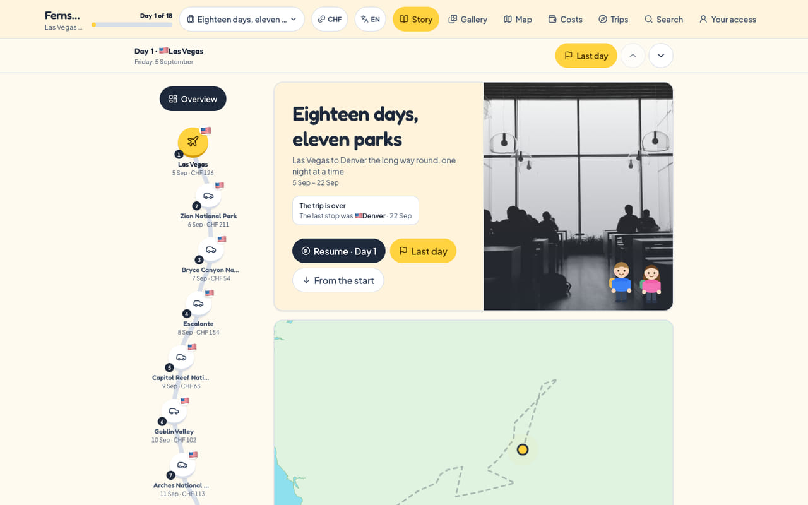
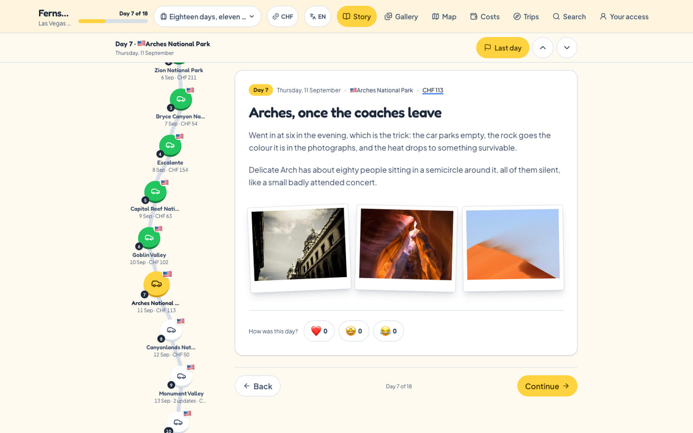
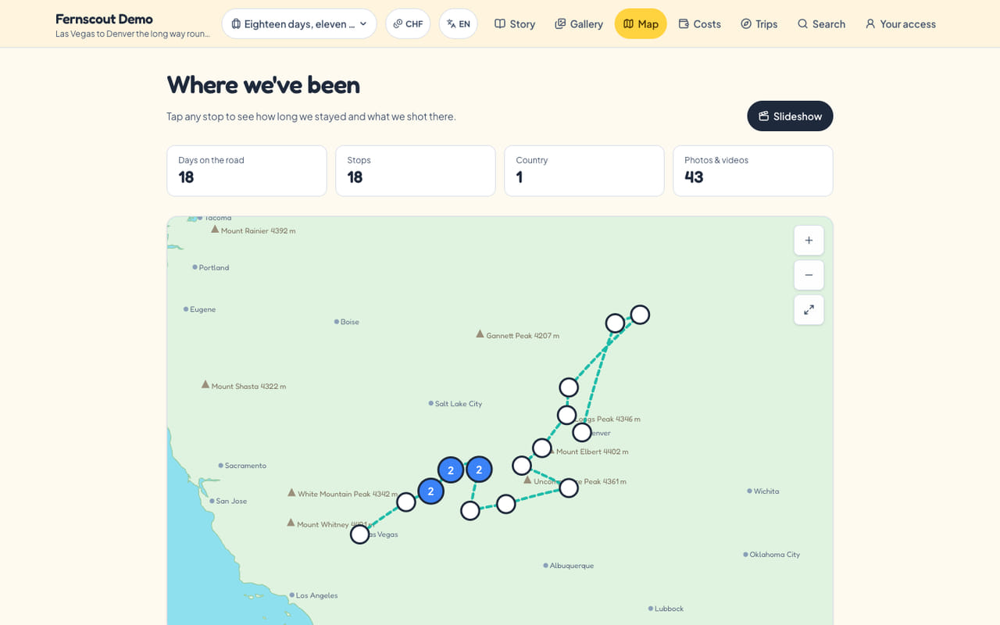
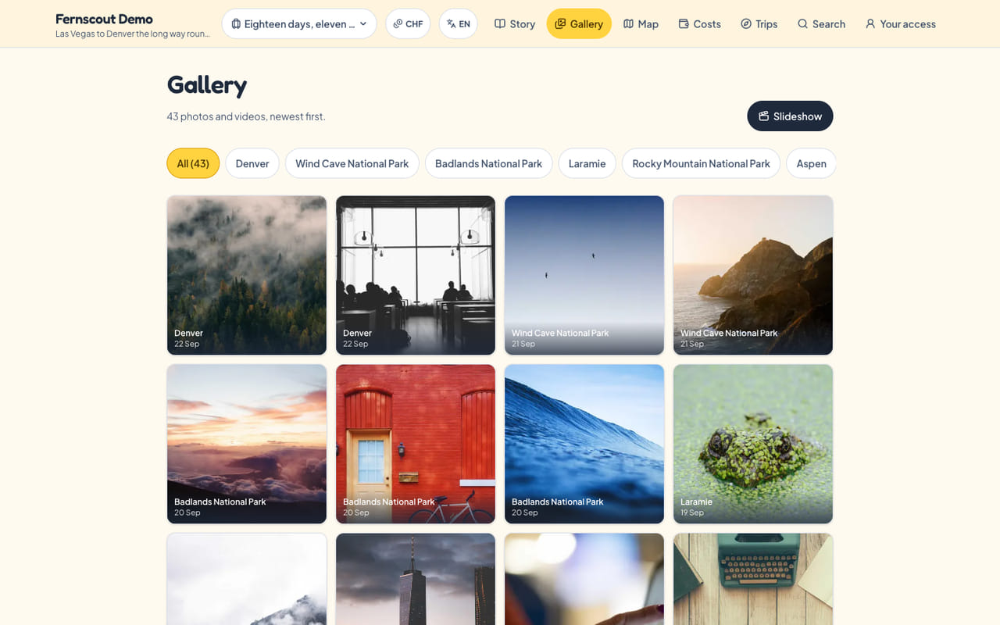

# Fernscout

*Travel mail — news from far away, arriving at home.*

A self-hostable travel journal: markdown entries with photos and video, a
winding day-by-day path, and a scroll-driven animation of the travellers moving
between stops.

Two things make it unlike the apps it resembles.

**Your content is markdown and photographs in a folder you own.** No database
is needed to run a public journal, and everything exports as the files it
already is.

**There is no editing interface, and there will not be one.** Reading happens
in a browser; writing happens through an agent holding a token, over REST.
Which means the rule everything else is built around:

> **The agent is the editor.** It writes, it publishes, it corrects — you tell
> it what you want and it does the work. Everything it writes arrives as a
> draft, so you can read a day back before it goes up; that is a courtesy to
> you, not a gate against it.

The one thing that stays out of an agent's hands is invention. One made-up
memory, presented to somebody's family as fact, is not recoverable — so an
agent writes what it was told and leaves a field empty rather than guessing,
and content nobody lived is marked `test: true` and says so on the page.

One instance serves many people: `content/<username>/…`, reachable at
`/<username>`. A demo journal ships in the repo and serves at `/example`, so a
fresh clone renders something real before you have written anything.

## What it looks like

Every picture below is that demo journal, on a production build. Nothing in it
belongs to a real person.



The story page. The rail on the left *is* the trip — one stop per day, with
what it cost. Scrolling it walks the travellers from stop to stop, which is the
one thing a still photograph cannot show you; clone it and scroll.



One day: markdown prose, its gallery, the day's spend, and the reactions
readers leave. This is one file in `entries/`, rendered.



Every stop on one map, drawn from the `lat` and `lng` in each entry's
frontmatter. The base map is baked into the build — no tile server, no API key,
nothing to pay for.



The gallery, filterable by place, with a slideshow behind the button.

*Captured at 1280 px wide, light theme, from `content/example/` — see
[docs/screenshots/](docs/screenshots/) before adding another.*

## Running it

```bash
npm install
npm run dev            # http://localhost:3000
```

That is the whole setup for a public journal. Every optional capability — mail,
sign-in, guests, push, print — is **off by default** and absent rather than
broken when disabled, so none of them needs a paid account to develop against:
mail writes `.eml` files to a folder, and every print provider has a dry-run
backend.

For a production build on your own machine, and the three things that otherwise
cost an hour, see [docs/running-locally.md](docs/running-locally.md).

## Writing with an agent

Hand an agent two things: the address of your instance's guide, and the email
the journal belongs to.

```
https://your-site.example/documentation.txt
```

It reads from there, asks for a six-digit code, and exchanges it for a token
that can write for seven days. Days arrive as drafts and go up when you say
so. `/agent.md` is the full guide,
generated from the same constants the endpoints enforce, so it cannot drift
from them.

Working in a checkout rather than over the network? [AGENTS.md](AGENTS.md) and
the skills in `.claude/skills/` cover the same jobs against files on disk.

## What a day looks like

One markdown file per update, in
`content/<username>/trips/<trip-id>/entries/`, named `YYYY-MM-DD-slug.md`.
Frontmatter is plain YAML, Obsidian-compatible:

```markdown
---
title: "Lanterns of Hoi An"
date: "2026-08-26"
time: "16:45"                 # orders several updates within one day
location: "Hoi An"
country: "Vietnam"
lat: 15.8801
lng: 108.338
transportMode: "bus"          # flight | train | bus | motorbike | boat | car | walk
transportFrom: "Da Lat"
transportTo: "Hoi An"
gallery:
  - src: "/media/<trip-id>/hoi-an/01.jpg"   # trip-relative; the username is added at read time
    type: "image"
    width: 1200
    height: 800
costs:
  - { label: "Dinner", amount: 180000, category: "food", currency: "VND" }
status: draft                 # present ⇒ not on the site
---

The diary text, in plain markdown.
```

Gaps are fine — no-signal days, rest days you skip. The path and "jump to
today" use whatever dates exist. Several updates on one day render as a branch
off that day. A day with no `transportMode` simply has no travel scene before
it.

A trip's own `trip.md` carries its title, dates, who was on it, and its
visibility: `private`, `public` or `guest`. An unrecognised value reads as
`private`, never as public — a typo must not publish somebody's trip.

## Commands

| | |
| --- | --- |
| `npm run dev` · `npm run build` · `npm start` | the site |
| `npm run build` · `npx tsc --noEmit` · `npx eslint .` · `npx vitest run` | the gate, all four before pushing — build **first**, it writes the route types `tsc` reads |
| `npm run ingest -- --user <u> --trip <id> <folder>` | a card of photos → dated, geotagged draft days |
| `npm run rates:update` | refresh the cached ECB rates |
| `npm run export -- <username>` | the whole journal as a zip |

## Documentation

Indexed at [docs/](docs/), which also says how far to trust it. A running
instance also serves an owner-facing guide at `/docs` — what to hand an
agent, a folder of photos or a markdown file, and how the site itself runs —
and the API reference at `/docs/api`. Both are generated from this README and
from `docs/ingest.md`, so they read the same as this file rather than a
second copy of it.

| | |
| --- | --- |
| [running-locally.md](docs/running-locally.md) | production build on your machine; the agent API end to end |
| [runbook.md](docs/runbook.md) | deploying to a VPS, backups, restore |
| [architecture.md](docs/architecture.md) | where things live, and why they are shaped that way |
| [ingest.md](docs/ingest.md) | photographs, EXIF, geodata |
| [currencies.md](docs/currencies.md) | how money is stored, converted and refused |
| [config-upgrades.md](docs/config-upgrades.md) | moving a config file forward a version |
| [deploy-mail.md](docs/deploy-mail.md) | mail, and the file transport that needs no SMTP |
| [providers/](docs/providers/) | the print providers |
| [TESTING.md](docs/TESTING.md) · [qa/](docs/qa/) | the manual walkthrough, and the scenario catalogue |
| [branding/](docs/branding/) | the mark, the palette, and what not to do to them |
| [ROADMAP.md](docs/ROADMAP.md) | the decision log — cited by number from the code |
| [tasks/](docs/tasks/) · [plans/](docs/plans/) | everything still to do, and the record of intent behind what shipped |

## Contributing

Read [CONTRIBUTING.md](CONTRIBUTING.md). In short: all four checks pass, the
dev server boots with a capability both on and off, and nothing personal goes
anywhere outside `content/` — there is a test that fails the build over that.

## Licence

AGPL-3.0. The **name and the waymark are not covered by it** — see
[TRADEMARK.md](TRADEMARK.md) before using either outside this repository.
